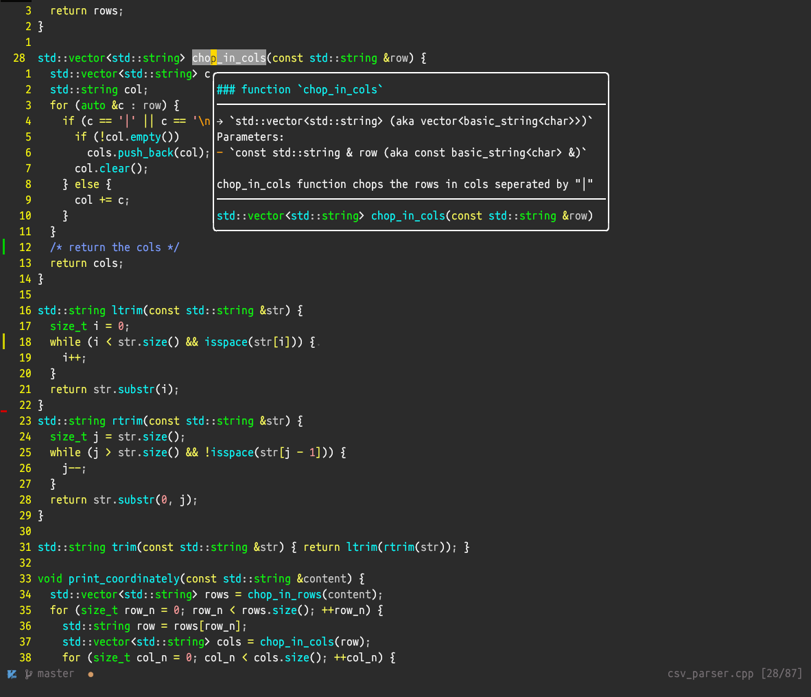
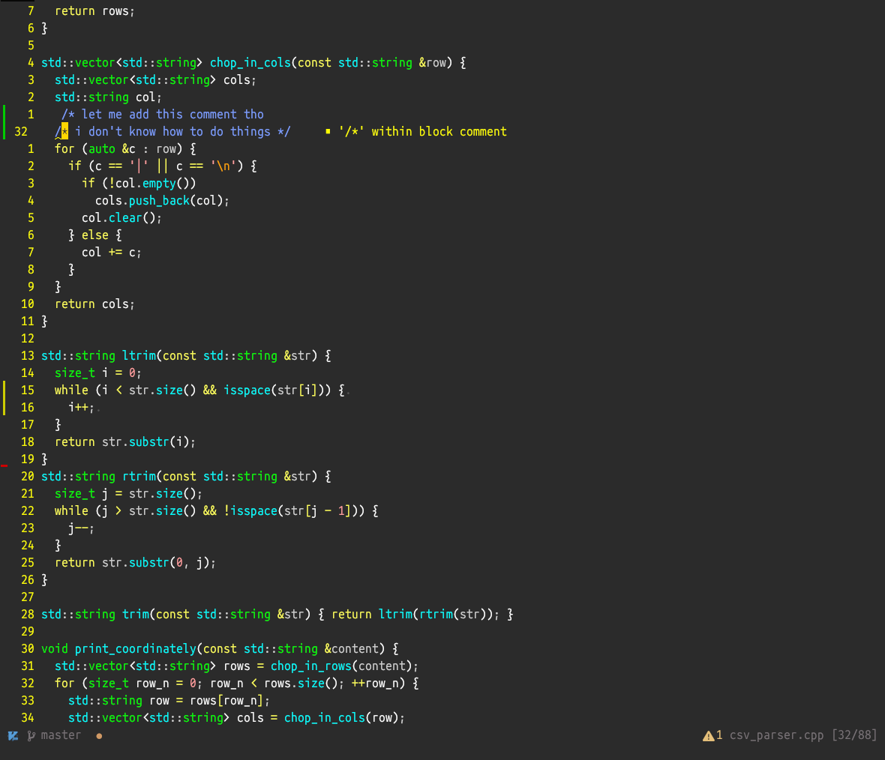

# pomatia.nvim

Have you ever fired up an old terminal and felt something was right about it? The green on black.
The cyan identifiers. The way yellow keywords practically buzzed off the screen.
No subtlety, no muted pastels — just raw phosphor light against dark glass, telling you exactly what the machine was doing.

**pomatia.nvim** is a port of `evening.vim`, one of the oldest colorschemes in Vim's history, originally written by Bram Moolenaar.
It is brought into modern Neovim with full treesitter, telescope, and gitsigns support.
The palette is untouched. The CRT soul is intact. *And if you think saturated colors are a sin, this is not the theme for you.*


|           |           |
|-----------|-----------|
|  |  |

---

## Features

- **Faithful palette**: Every color is preserved from the original evening.vim. Salmon constants, periwinkle comments, phosphor green types, neon yellow keywords.
I wanted this old aesthetics once in a while.
- **Treesitter support**: Full `@capture` group coverage including LSP semantic tokens.
- **Plugin support**: Telescope, gitsigns, nvim-cmp, etc.
- **Highlight cache**: Computed highlights are serialized to disk on first load and applied directly on every subsequent startup — zero recomputation, zero module traversal.
- **Transparent background**: Could enable transparency
- **Configurable**: Italic comments, bold keywords, diagnostic underline style, and per-group overrides.

---

## Installation

With [lazy.nvim](https://github.com/folke/lazy.nvim):

```lua
{
  "aliqyan-21/pomatia.nvim",
  priority = 1000,
  config = function()
    require("pomatia").setup({})
    vim.cmd.colorscheme("pomatia")
  end,
}
```

With [packer.nvim](https://github.com/wbthomason/packer.nvim):

```lua
use {
  "aliqyan-21/pomatia.nvim",
  config = function()
    require("pomatia").setup({})
    vim.cmd.colorscheme("pomatia")
  end,
}
```

---

## Configuration

```lua
require("pomatia").setup({
  -- Transparency enable
  transparent = false,

  -- Set terminal_color_0 through terminal_color_15 for :terminal buffers.
  terminal_colors = true,

  -- Italic comments enable.
  italic_comments = true,

  -- Bold keywords and types, matching the original evening.vim behaviour.
  bold_keywords = true,

  -- Slightly dim text in unfocused splits.
  dim_inactive_wins = false,

  -- Diagnostic underline style: "straight" or "curl"
  underline_diagnostics = "straight",

  -- enable caching of theme for fast load up
  caching = true,

  -- Override any highlight group after everything else is applied.
  overrides = {},
})
```

---
## Overrides

The `overrides` table lets you change any highlight group without touching the source files.

```lua
require("pomatia").setup({
  overrides = {
    Normal  = { bg = "#242424" },
    Comment = { fg = "#80a0ff" },
    LineNr  = { fg = "#888800" },
  },
})
```

---

## Supported Plugins

- [x] **telescope.nvim**
- [x] **gitsigns.nvim**
- [x] **nvim-cmp**
- [ ] **which-key.nvim**
- [ ] **mini.nvim**

---

## TODO
I have tried to keep the implementation as minimal as possible, making it fully functional.
But some important things will be added soon such as more plugins support!

---

## Credits

Original **evening.vim** by Bram Moolenaar, maintained by Steven Vertigan.
Source: https://github.com/vim/colorschemes/tree/master/colors/evening.vim
