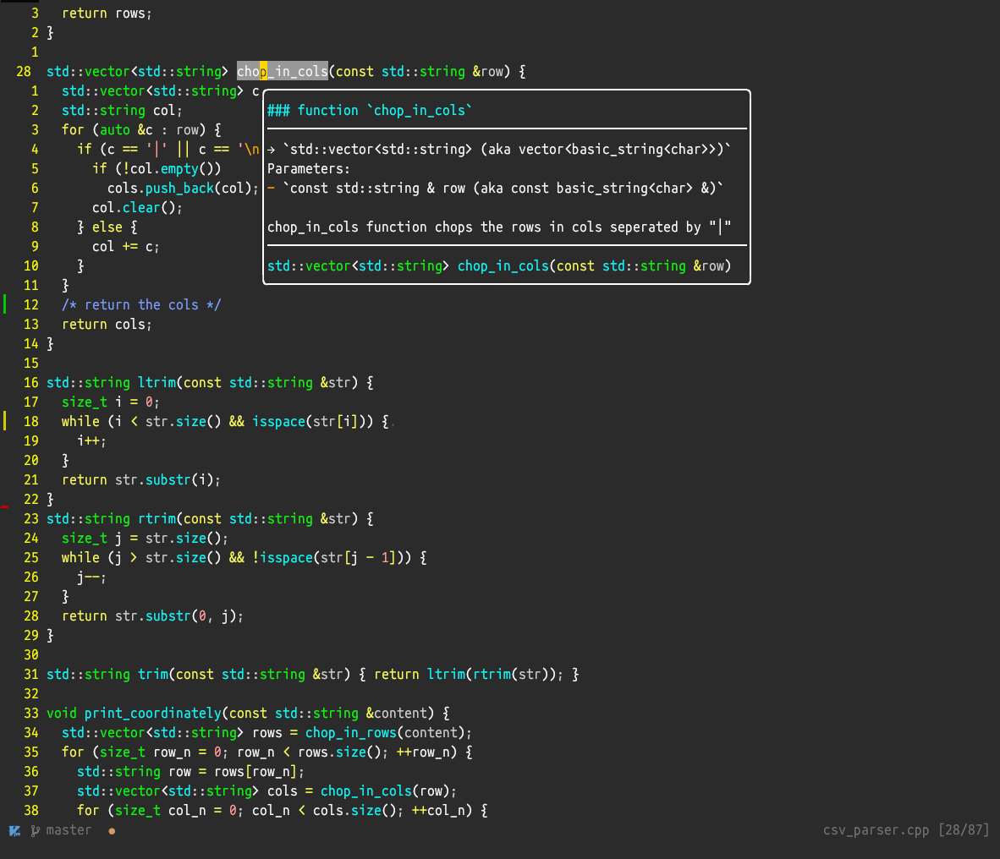
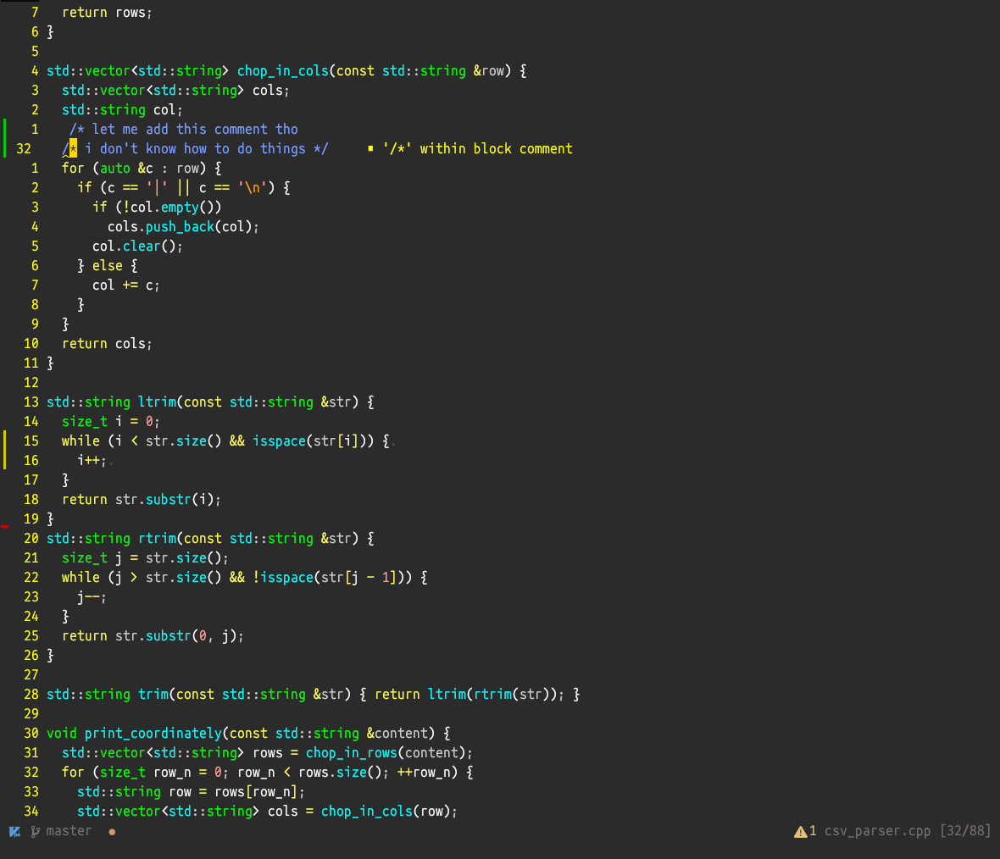
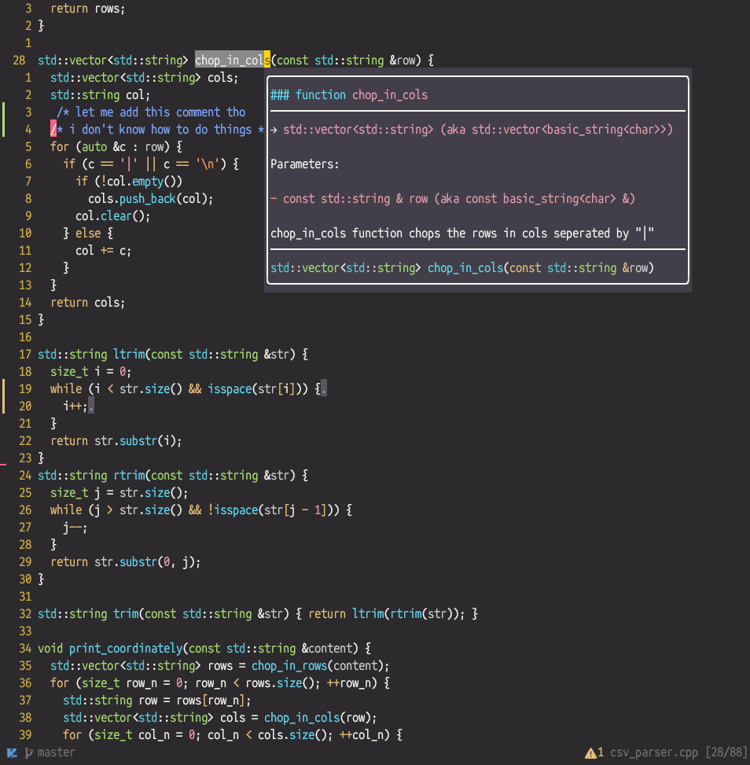
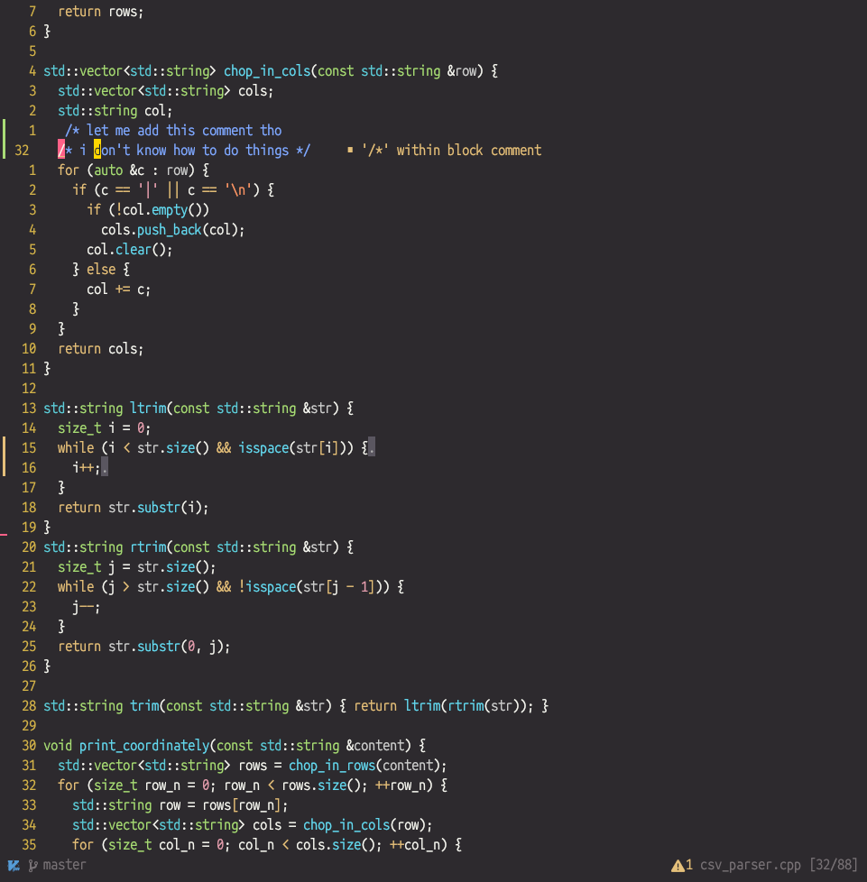
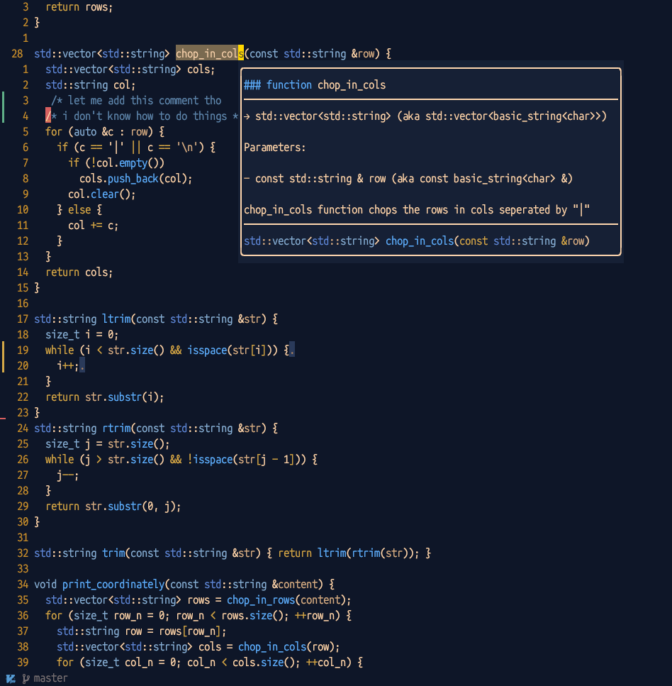
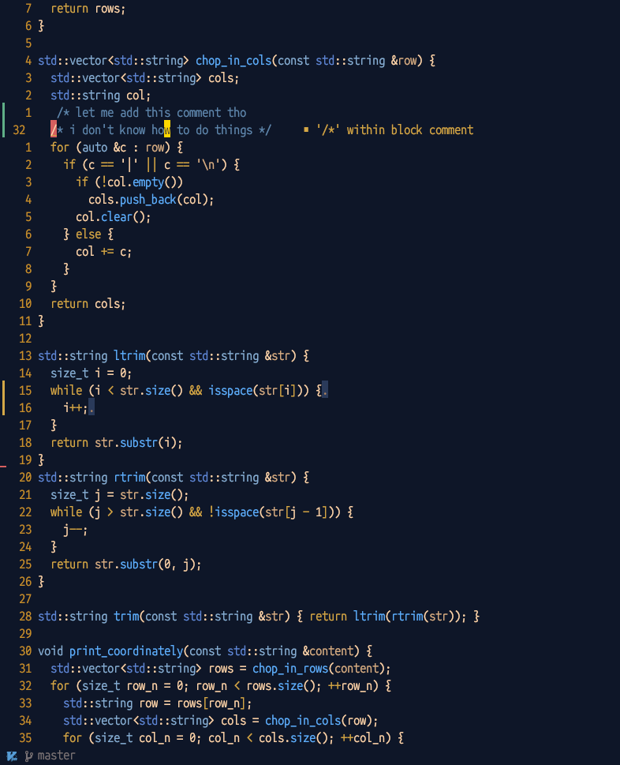
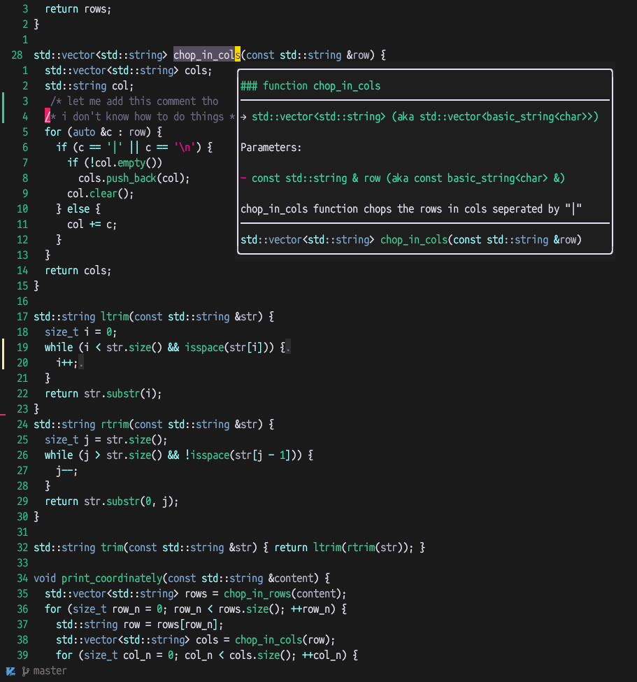
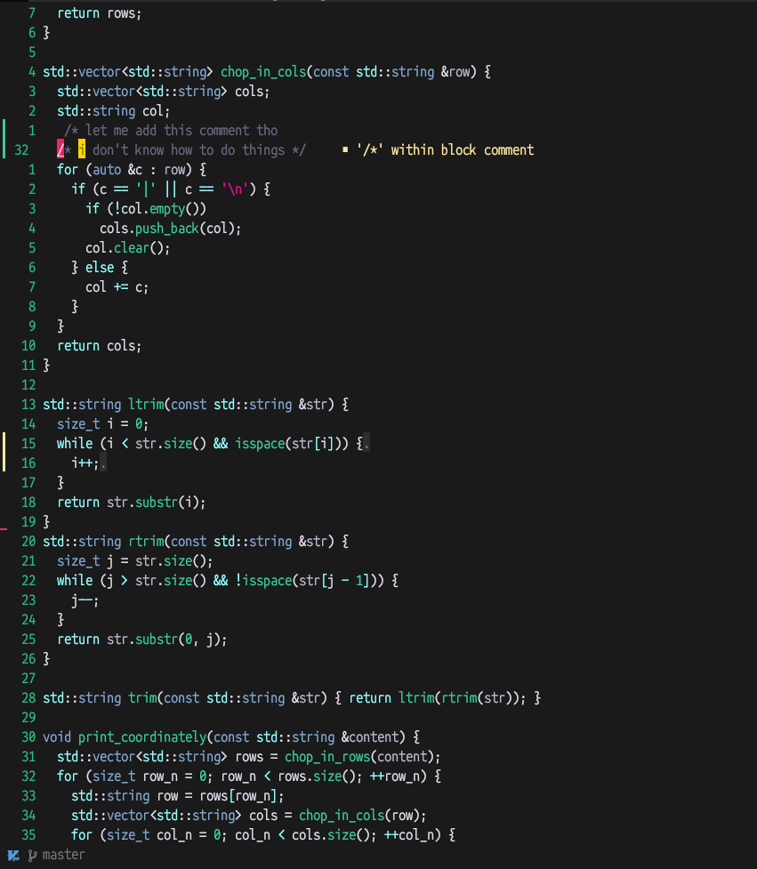

# pomatia.nvim

`pomatia.nvim` is not a single colorscheme. It is a collection of carefully considered palettes, each one built
from a different philosophy, a different source of inspiration.
Then default is a direct port of evening.vim one of the oldest colorschemes
in Vim's history, written by Bram Moolenaar himself.

## Preview

### 1. default
Pure primaries on a neutral gray. Cyan functions, green types, yellow keywords, salmon
constants. The retro saturated colors and CRT aesthetics

<details>
<summary>click</summary>

|           |           |
|-----------|-----------|
|  |  |

</details>

### 2. soft (softer version of default)
Same color families, pulled back from the edge.
Amber instead of raw yellow, sage instead of nuclear green.
For when eyes are tired or something...

<details>
<summary>click</summary>

|           |           |
|-----------|-----------|
|  |  |

</details>

### 3. noble (inspired by vim-orbital)
A navy background so dark it feels like looking out a cockpit window. Foreground text in
warm cream. Syntax rendered entirely in blues - cold, structural, orbital. Keywords glow
amber, like old terminal phosphor. The contrast between cold and warm is the whole point.

<details>
<summary>click</summary>

|           |           |
|-----------|-----------|
|  |  |

</details>

### 4. lucid (inspired by vim-colors-lucid)
dark background. Syntax in genuinely different hue families - emerald turquoise for
keywords, pale sky for functions, steel blue for types, lime green for strings, hot pink
for preprocessor. Nothing shares a hue family with anything else. The result is the
unmistakable clarity.

<details>
<summary>click</summary>

|           |           |
|-----------|-----------|
|  |  |

</details>

---

## Features

- **Treesitter support**: Full `@capture` group coverage including LSP semantic tokens.
- **Plugin support**: Telescope, gitsigns, nvim-cmp, etc.
- **Highlight cache**: Computed highlights are serialized to disk on first load and applied directly on every subsequent startup — zero recomputation, zero module traversal.
- **Transparent background**: Could enable transparency
- **Configurable**: Italic comments, bold keywords, diagnostic underline style, and per-group overrides.

---

## Installation

With [lazy.nvim](https://github.com/folke/lazy.nvim):

```lua
{
  "aliqyan-21/pomatia.nvim",
  priority = 1000,
  config = function()
    require("pomatia").setup({})
    vim.cmd.colorscheme("pomatia")
  end,
}
```

With [packer.nvim](https://github.com/wbthomason/packer.nvim):

```lua
use {
  "aliqyan-21/pomatia.nvim",
  config = function()
    require("pomatia").setup({})
    vim.cmd.colorscheme("pomatia")
  end,
}
```

---

## Configuration

```lua
require("pomatia").setup({
  -- set variant ("default" if variant not set)
  variant = "default", -- "default" | "soft" | "noble" | "lucid"

  -- Transparency enable
  transparent = false,

  -- Set terminal_color_0 through terminal_color_15 for :terminal buffers.
  terminal_colors = true,

  -- Italic comments enable.
  italic_comments = true,

  -- Bold keywords and types, matching the original evening.vim behaviour.
  bold_keywords = true,

  -- Slightly dim text in unfocused splits.
  dim_inactive_wins = false,

  -- Diagnostic underline style: "straight" or "curl"
  underline_diagnostics = "straight",

  -- enable caching of theme for fast load up
  caching = true,

  -- enable/disable the background of the
  -- list chars (so not related to transparency)
  listchar_bg = true,

  -- Override any highlight group after everything else is applied.
  overrides = {},

})
```

---
## Overrides

The `overrides` table lets you change any highlight group without touching the source files.

```lua
require("pomatia").setup({
  overrides = {
    Normal  = { bg = "#242424" },
    Comment = { fg = "#80a0ff" },
    LineNr  = { fg = "#888800" },
  },
})
```

---

## Supported Plugins

- [x] **telescope.nvim**
- [x] **gitsigns.nvim**
- [x] **nvim-cmp**
- [ ] **which-key.nvim**
- [ ] **mini.nvim**

---

## TODO
I have tried to keep the implementation as minimal as possible, making it fully functional.
But some important things will be added soon such as more plugins support!

---

## Credits

**evening.vim** by Bram Moolenaar, maintained by Steven Vertigan.
Source: https://github.com/vim/colorschemes/tree/master/colors/evening.vim

**orbital.vim**: Source: https://github.com/fcpg/vim-orbital

**vim-256noir**: Source: https://github.com/andreasvc/vim-256noir

**vim-colors-lucid**: Source: https://github.com/cseelus/vim-colors-lucid
